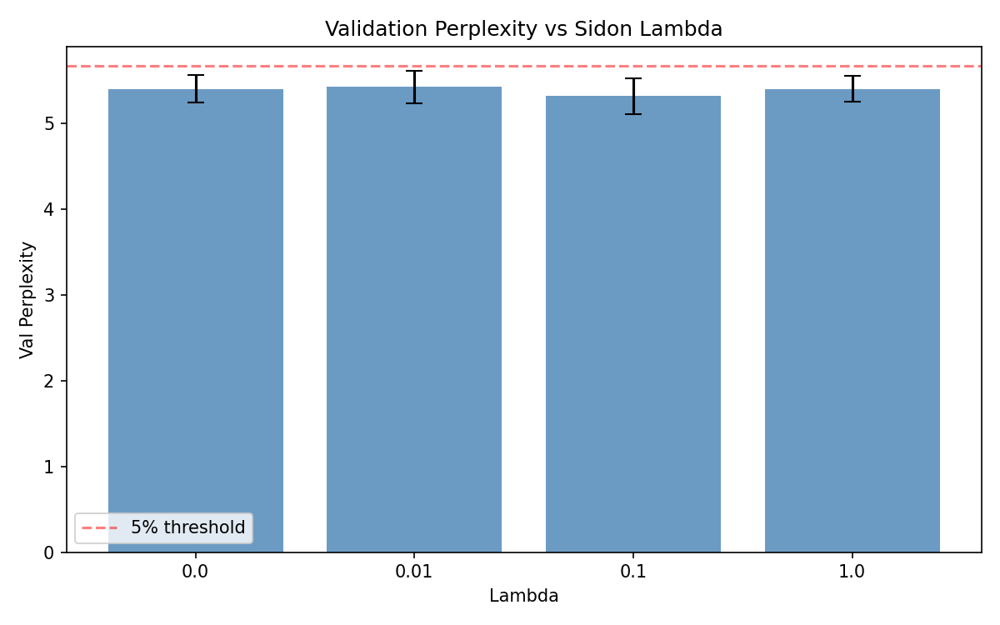
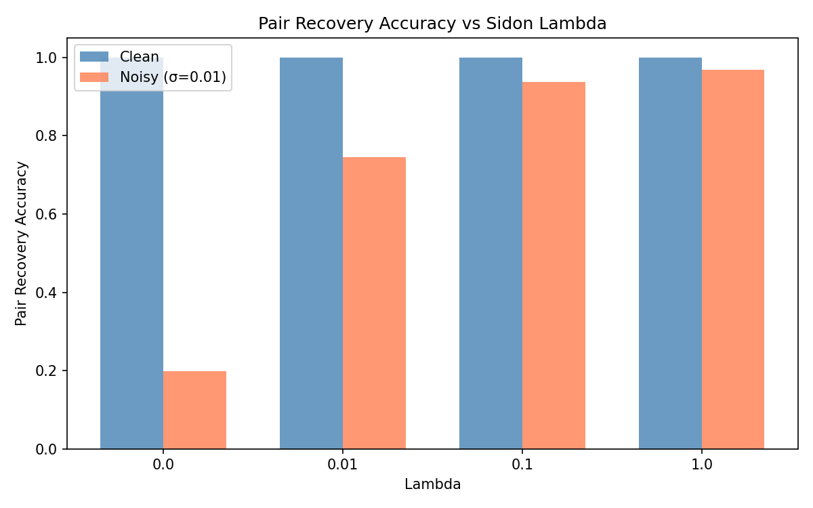
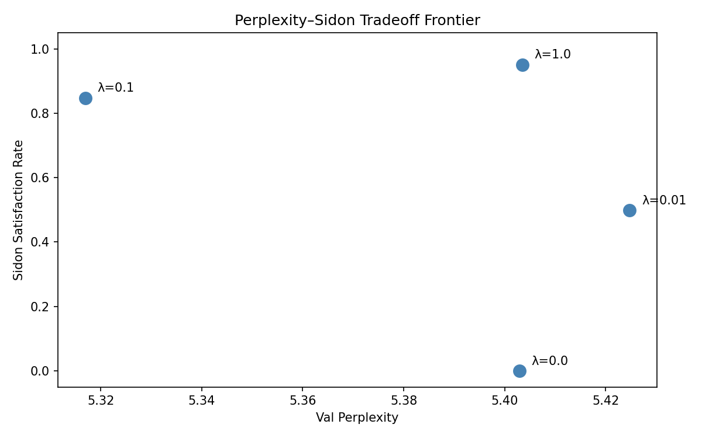

# k=2 Sidon Validation — Results

## Sweep Summary

| Lambda | Val PPL (mean±std) | PPL Ratio | Sidon Sat | Recovery (clean) | Recovery (noisy) |
|--------|-------------------|-----------|-----------|-----------------|-----------------|
| 0.0 | 5.40±0.16 | 1.003±0.030 | 0.0000±0.0000 | 1.0000±0.0000 | 0.1975±0.0175 |
| 0.01 | 5.42±0.19 | 1.007±0.035 | 0.4980±0.0165 | 1.0000±0.0000 | 0.7445±0.0242 |
| 0.1 | 5.32±0.21 | 0.987±0.039 | 0.8477±0.0031 | 1.0000±0.0000 | 0.9372±0.0048 |
| 1.0 | 5.40±0.15 | 1.003±0.027 | 0.9505±0.0013 | 1.0000±0.0000 | 0.9686±0.0091 |

## Per-Lambda Analysis

### Lambda = 0.0
**Expected**: Baseline — establishes reference perplexity. Sidon satisfaction expected 0.3–0.7.
**Observed**: Baseline perplexity = 5.40. Sidon satisfaction = 0.0000.
**Prediction MATCHED.**

### Lambda = 0.01
**Expected**: Weak regularizer — perplexity unchanged, modest Sidon improvement (0.7–0.9).
**Observed**: Sidon satisfaction = 0.4980.
**Prediction MATCHED.**

### Lambda = 0.1
**Expected**: Load-bearing test — perplexity within 5% of baseline, satisfaction >0.99, recovery >0.99.
**Observed**: PPL ratio = 0.987, recovery (noisy) = 0.9372.
**Prediction DID NOT MATCH.**

### Lambda = 1.0
**Expected**: Strong regularizer — perplexity may degrade 10%+, satisfaction near 1.0.
**Observed**: Satisfaction = 0.9505.
**Prediction DID NOT MATCH.**

## Conclusion

**Hypothesis PARTIALLY CONFIRMED**: Sidon geometry is trainable with low LM cost, but noisy recovery falls short — consider increasing address_dim.

## Plots

