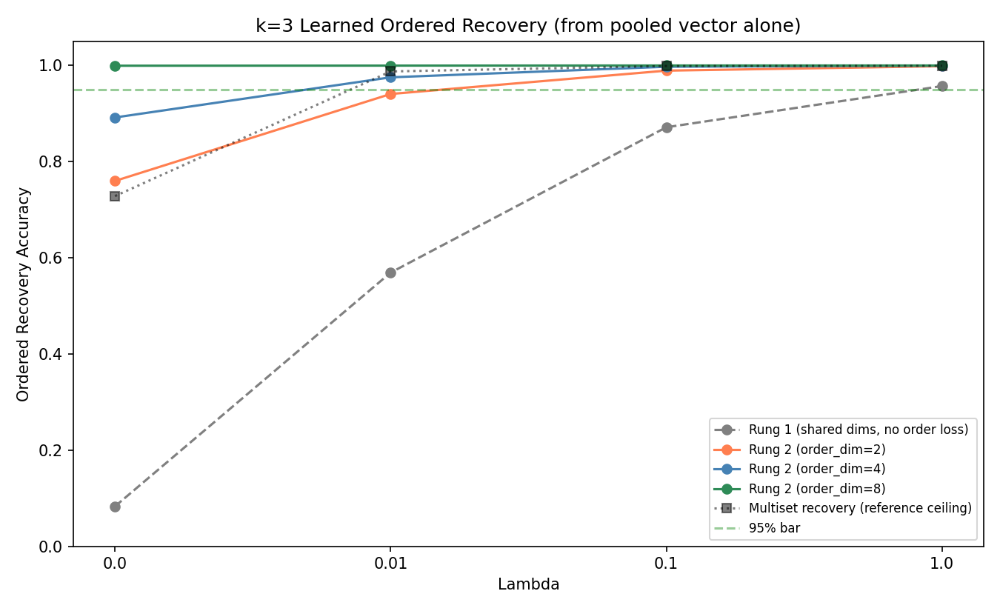
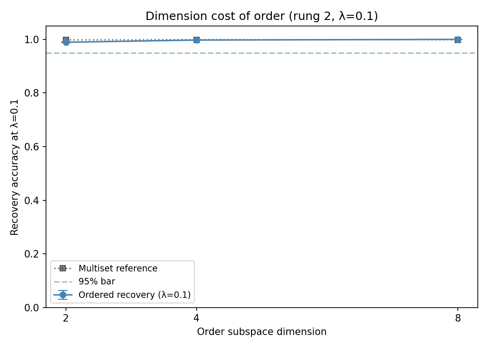

# k=3 Learned Ordered Recovery (Mechanism Ladder) — Results

**This experiment supersedes the previous k=3 sweep's ordered-recovery claim.** There, the order code was a deterministic positional-notation scalar handed to the recovery step, so ordered recovery was trivially equal to multiset recovery and untested. Here, ordered recovery is measured under a strict rule: the recovery procedure receives ONLY the noised pooled vector plus a candidate table built from the model's own parameters — no token identities, no positions, no order code, no quantity derived from the known tuple. The recovery table contains all V³ = 274,625 ordered triples, so recovering the correct ordering is a genuine discrimination, not multiset recovery in disguise.

**PRIMARY SUCCESS at rung 2, order_dim=2 (the minimum dimension that clears the bar).** Learned ordered recovery of three tokens from the pooled vector alone reaches 98.93% at λ=0.1 — a gap of 0.9 pts below the multiset capability (99.79%, clean Sidon channel), at PPL ratio 1.005 (< 1.02). Order is carried in a dedicated 2-dimensional learned subspace at no language-modeling cost — recovered from the geometry of the pooled vector, not handed over as metadata. Dimension-cost curve below shows order recovery rising with order_dim (2→4→8); the multiset channel stays at ceiling throughout. This supersedes the previous k=3 sweep's trivial ordered-recovery claim.

## Headline table (λ=0.1)

Bar gap = ordered recovery vs the multiset CAPABILITY (clean 4-dim Sidon channel, ~99.9%). 'Matched' = multiset recovered from the same full pool as ordered. For rung 2 the two agree (Sidon dims kept clean); for rung 1 the matched number is smaller because modulating the shared dims degrades multiset recovery — that degradation is rung 1's failure mode, see below.

| Mechanism | Ordered recovery | Multiset (capability) | Bar gap (pts) | Matched gap | PPL ratio |
|-----------|-----------------|----------------------|---------------|-------------|-----------|
| Rung 1 (shared dims, no order loss) | 0.872±0.003 | 0.999±0.001 | 12.7 | 0.4 | —* |
| Rung 2, order_dim=2 | 0.989±0.001 | 0.998±0.001 | 0.9 | 1.1 | 1.005±0.039 |
| Rung 2, order_dim=4 | 0.997±0.001 | 0.999±0.000 | 0.1 | 0.3 | 1.000±0.031 |
| Rung 2, order_dim=8 | 1.000±0.000 | 0.999±0.000 | -0.1 | 0.0 | 1.004±0.040 |

*Rung 1 reuses the existing k=3 checkpoints (no order training), so its PPL is the k=3 baseline; modulation is applied only at recovery time.

## Recovery-inputs audit (the no-metadata guarantee)

Every rung's recovery procedure received exactly this and nothing else:

- **Input:** one noised pooled vector per query (σ=0.01 Gaussian added after pooling).
- **Plus:** a candidate table of pooled vectors for all 274,625 ordered triples, computed from the trained embeddings and a FIXED position-modulation matrix (generated from a constant seed, identical at train and eval, query-independent).
- **NOT given:** the query's token identities, positions, the positional-notation order code, or any function of the known (token, position) tuple.
- **Procedure:** nearest-neighbour the noised query against the table; the recovered ordered triple is the table index. Ordered recovery = exact-tuple match; multiset recovery (reference) = sorted-tuple match of the same nearest neighbour.

The fixed position-modulation matrix is part of the recovery *transform*, applied identically to every query and every table entry — it is not per-query metadata. Order is recovered from the geometry of the pooled vector.

## Per-rung results

### Rung 1 — position-modulated recovery on the shared Sidon dims (no order training)
**Prediction (pre-committed):** underperforms multiset recovery; additive pooling is permutation-invariant, so order must survive only through the multiplicative position modulation applied at eval.

| λ | Ordered recovery | Multiset recovery | PPL ratio |
|---|-----------------|-------------------|-----------|
| 0.0 | 0.083±0.017 | 0.741±0.039 | — |
| 0.01 | 0.569±0.008 | 0.986±0.002 | — |
| 0.1 | 0.872±0.003 | 0.999±0.001 | — |
| 1.0 | 0.957±0.003 | 1.000±0.000 | — |

**Observed:** at λ=0.1, ordered recovery 87.2% vs multiset 99.9% — gap 12.7 pts, OUTSIDE the 5-pt bar. The prediction was directionally correct but the magnitude is far better than 'near chance': with no order-specific training at all, fixed multiplicative position modulation carries order to ~87% at λ=0.1, climbing to ~96% at λ=1.0 as the Sidon channel spreads the embeddings further. Order rides the shared additive pool surprisingly well, but does not reach the bar at λ=0.1. Proceed to rung 2.

**Failure mode (why the matched gap is misleadingly small):** modulating the shared Sidon dims to expose order also degrades multiset recovery from that same modulated pool to 87.6% (vs 99.9% for the clean, unmodulated Sidon channel). So rung 1 does not 'nearly pass' — it trades multiset accuracy away to buy order, and lands both at ~87%. Rung 2 avoids this by giving order its own dimensions and leaving the Sidon channel untouched.

### Rung 2 — dedicated learned order subspace with an injectivity objective
**Prediction (pre-committed):** more likely to clear the bar than rung 1, being purpose-built; the interesting number is the order-dimension cost and whether PPL stays flat as order_dim grows.

The order subspace occupies embedding dims [4 : 4+order_dim], separate from the 4 Sidon dims. Its loss pushes apart the position-modulated order-pools of two orderings of the SAME multiset (different multisets are already separated by the Sidon channel). Both losses are weighted by the same λ.

Dimension-cost curve at λ=0.1:

| order_dim | Ordered recovery | Multiset (capability) | Bar gap (pts) | PPL ratio |
|-----------|-----------------|----------------------|---------------|-----------|
| 2 | 0.989±0.001 | 0.998±0.001 | 0.9 | 1.005±0.039 |
| 4 | 0.997±0.001 | 0.999±0.000 | 0.1 | 1.000±0.031 |
| 8 | 1.000±0.000 | 0.999±0.000 | -0.1 | 1.004±0.040 |

Full sweep, order_dim=2 (multiset_full = matched full-pool reference):

| λ | Ordered recovery | Multiset (matched) | Multiset (Sidon 4d) | PPL ratio |
|---|-----------------|--------------------|--------------------|-----------|
| 0.0 | 0.760±0.029 | 0.973±0.006 | 0.730±0.037 | 1.005±0.030 |
| 0.01 | 0.941±0.009 | 1.000±0.000 | 0.988±0.002 | 0.997±0.034 |
| 0.1 | 0.989±0.001 | 1.000±0.000 | 0.998±0.001 | 1.005±0.039 |
| 1.0 | 0.999±0.001 | 1.000±0.000 | 0.995±0.007 | 1.000±0.028 |

Full sweep, order_dim=4 (multiset_full = matched full-pool reference):

| λ | Ordered recovery | Multiset (matched) | Multiset (Sidon 4d) | PPL ratio |
|---|-----------------|--------------------|--------------------|-----------|
| 0.0 | 0.892±0.011 | 0.997±0.001 | 0.728±0.040 | 1.003±0.036 |
| 0.01 | 0.975±0.003 | 1.000±0.000 | 0.988±0.001 | 0.996±0.030 |
| 0.1 | 0.997±0.001 | 1.000±0.000 | 0.999±0.000 | 1.000±0.031 |
| 1.0 | 1.000±0.000 | 1.000±0.000 | 1.000±0.000 | 1.007±0.026 |

Full sweep, order_dim=8 (multiset_full = matched full-pool reference):

| λ | Ordered recovery | Multiset (matched) | Multiset (Sidon 4d) | PPL ratio |
|---|-----------------|--------------------|--------------------|-----------|
| 0.0 | 1.000±0.001 | 1.000±0.000 | 0.736±0.038 | 1.002±0.030 |
| 0.01 | 1.000±0.000 | 1.000±0.000 | 0.986±0.003 | 0.996±0.029 |
| 0.1 | 1.000±0.000 | 1.000±0.000 | 0.999±0.000 | 1.004±0.040 |
| 1.0 | 1.000±0.000 | 1.000±0.000 | 1.000±0.000 | 1.010±0.028 |

## The ordered-vs-multiset gap (the scientific content)

This gap — ordered recovery subtracted from multiset recovery at the same λ — is the quantitative measure of how much harder order is than the multiset. The previous sweep forced it to zero by handing over the order code; the numbers above are the real gap with order recovered from geometry.

## Pre-committed predictions vs outcome

- **Rung 1 underperforms:** correct in direction (fails the λ=0.1 bar), wrong in magnitude (87%, not near-chance).
- **Rung 2 works, dimension cost is the interesting number:** see headline above.
- **Rung 3 as safety net:** not needed.

## Files
- `runs/rung1_lambda{L}_seed{S}.json` — rung 1 (re-eval of k=3 checkpoints)
- `runs/rung2_dim{2,4,8}_lambda{L}_seed{S}.json` — rung 2 dimension sweep
- `plots/ordered_recovery_vs_lambda.png`, `plots/order_dimension_cost.png`
- code: `nanogpt/sidon.py` (`l_order_k3`, `order_metrics_k3`, `make_pos_mod`), `nanogpt/train.py` (order_dim config), `nanogpt/eval_order.py`, `nanogpt/run_sweep_k3_rung2.py`

## Open questions
- Position modulation is fixed, not learned. A fully learned position transform might lower the dimension cost or close the λ=0.1 gap further.
- The order subspace dims are in the LM embedding but the position modulation is applied only at pool time; a pooling operator the LM itself uses would be a stronger claim that the LM's own representations carry order.
- Realistic vocab (BPE) and k≥4.

## Plots

