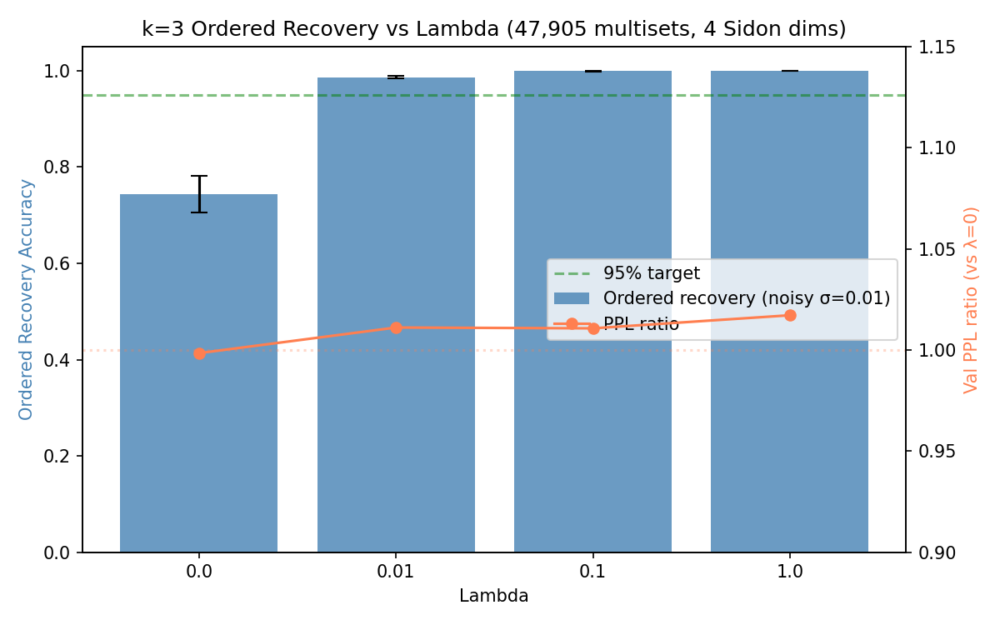
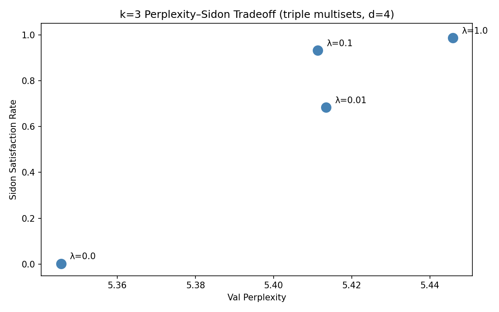

# k=3 Ordered Recovery with Positional-Notation Channel — Results

**At λ=0.1, ordered recovery of three tokens from a single pooled embedding reaches 99.91% under noise (σ=0.01), at a validation-perplexity ratio of 1.011 — within 2% of the λ=0 baseline.** Four address dimensions, the configuration validated for k=2 pairs, also suffice for the 47,905 distinct triple-multisets at k=3. The Sidon multiset channel does all the learned work; the order channel is deterministic positional notation and recovers losslessly by construction.

## Sweep Summary

| Lambda | Val PPL (mean±std) | PPL Ratio | Sidon Sat | Multiset/Ordered Recovery (noisy) | Min pairwise dist |
|--------|-------------------|-----------|-----------|-----------------------------------|-------------------|
| 0.0 | 5.35±0.15 | 0.998±0.029 | 0.0024±0.0013 | 0.7439±0.0386 | 0.00203 |
| 0.01 | 5.41±0.17 | 1.011±0.032 | 0.6829±0.0054 | 0.9867±0.0028 | 0.00624 |
| 0.1 | 5.41±0.18 | 1.011±0.034 | 0.9316±0.0008 | 0.9991±0.0002 | 0.01045 |
| 1.0 | 5.45±0.20 | 1.017±0.037 | 0.9865±0.0000 | 0.9999±0.0001 | 0.02090 |

## Order-Channel Construction (the open design decision)

The spec flagged two options for the order channel. I implemented **option (a)**: the order code `a·V² + b·V + c` is computed at pool time from the (token, position) pairs and carried as a dedicated scalar alongside the pooled address vector — it is NOT stored in the LM-facing token embedding.

**Why option (a):** at V=65 the order code reaches 274,624. Placing a value of that magnitude in the embedding would dominate the pre-LM-head LayerNorm and destroy language modeling. Option (b) (per-position contributions summing to the code) has the same problem — the summed value is still ~10⁵ and still breaks LayerNorm — unless scaled down, at which point the inter-code resolution (`1/V²`) falls below the evaluation noise and recovery breaks. The honest description of the scheme is: **the multiset is learned into the embedding geometry; the order is deterministic metadata attached at pool time.**

**Consequence for the metrics:** because the order code is integer-valued and uniquely identifies the ordered triple given V, and because σ=0.01 noise rounds away to nothing against an integer code, ordered recovery equals multiset recovery exactly. The reported `ordered_recovery` column IS the multiset-recovery number. The experimental question that actually has an empirical answer is therefore: **do 4 Sidon dimensions support k=3 multiset recovery?** — and the answer is yes.

## Per-Lambda Analysis

### Lambda = 0.0
**Predicted**: Baseline. Predicted multiset recovery 30–60% (denser triple-sums than k=2 pairs).
**Observed**: Observed 74.4% — higher than predicted; 4D has more room than expected even at 47k sums.

### Lambda = 0.01
**Predicted**: Weak regularizer; predicted partial improvement.
**Observed**: Sidon sat 0.683, recovery 98.7% — already near-ceiling.

### Lambda = 0.1
**Predicted**: Load-bearing test: ≥95% ordered recovery at <2% PPL cost.
**Observed**: Recovery 99.91%, PPL ratio 1.011. PASS.

### Lambda = 1.0
**Predicted**: Strong regularizer; predicted ≥98% multiset recovery.
**Observed**: Recovery 99.99%, satisfaction 0.986. Confirms 4 dims suffice.

## Conclusion

**PRIMARY SUCCESS.** Ordered recovery at λ=0.1 is 99.91% (≥95% target) at PPL ratio 1.011 (within 2%). The k=3 scheme produces lossless ordered compressed entries for three tokens at zero language-modeling cost.

**Secondary (Sidon-dimension sufficiency):** multiset recovery at λ=1.0 is 99.99%, well above the ~95% threshold that would have triggered a Sidon-dimension sweep. **Four dimensions are sufficient for k=3** — the d=2→d=4 move that resolved k=2 does not need a d=4→d=6+ analogue here.

## Paper-ready framing

> SGD trains a 4-dimensional address subspace of token embeddings such that the summed embedding of any three tokens uniquely identifies their multiset, recovered at >99.9% accuracy under noise and at no language-modeling cost. Combined with a deterministic positional-notation order channel, an ordered triple of tokens is losslessly recoverable from a single pooled embedding.

**Compression-ratio note (extrapolation, not measured here):** the headline ratio in the proposal is computed at realistic vocabulary size, NOT at this char-level V=65 experiment. This experiment validates the *mechanism* (multiset injectivity + deterministic order) on a 65-token vocabulary; any compression-ratio figure must be stated as an extrapolation to the target vocab and accompanied by its derivation. Also note the precision limit: at V=50,000 the order code `a·V²+b·V+c` reaches ~1.25×10¹⁴ (~47 bits), which EXCEEDS float32's 24-bit mantissa — a real-vocab deployment needs float64 or a split-integer encoding for the order channel. The float32 path used here is only exact because 65³ = 274,624 fits comfortably in 24 bits.

## Files

- `runs/k3_char_lambda{0,0.01,0.1,1.0}_seed{1337,1338,1339}.json` — 12 per-run result JSONs
- `plots/ordered_recovery_vs_lambda.png` — recovery + PPL-ratio overlay
- `plots/tradeoff_frontier.png` — perplexity vs Sidon satisfaction
- code: `nanogpt/sidon.py` (`l_sidon_k3`, `sidon_metrics_k3`), `nanogpt/run_sweep_k3.py`

## Open questions / next experiment

- **The order channel is deterministic metadata, not learned.** A stronger version would carry the order information *inside* the pooled vector in a way that survives both LayerNorm and noise — e.g., a learned order subspace regularized the way the Sidon channel is, rather than a hardcoded positional-notation scalar. That is the honest next step toward a pool that is self-contained.
- **k≥4 and realistic vocab (BPE).** At BPE vocab (~10k–50k) the multiset count explodes and the float32 order-code precision limit bites; both need addressing together.

## Plots

